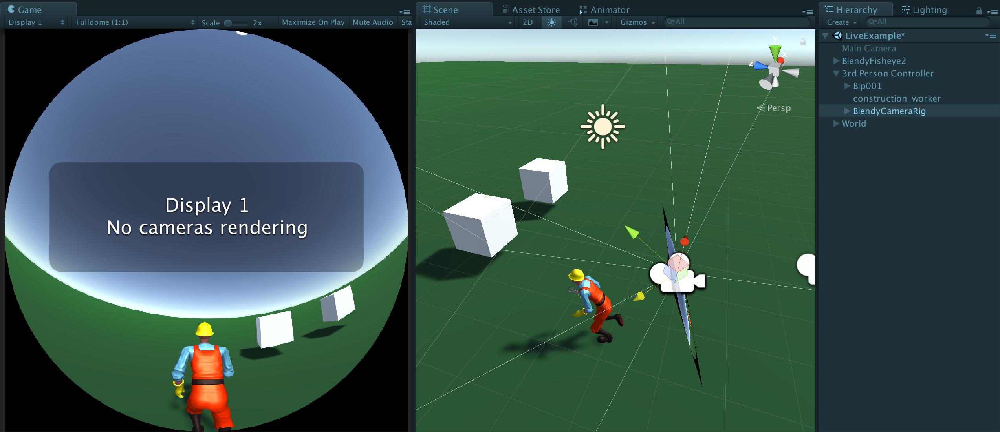

# FulldomeCameraForUnity5

Fulldome Camera plugin for Unity 5.6

For Unity 2018+, use [FulldomeCameraForUnity](https://github.com/rsodre/FulldomeCameraForUnity)

## Usage

To run a Fulldome game, this plugin needs two prefabs in your scene. A `Camera Rig` and a `Controller`.

### Camera Rig

* Place `FulldomeCamera/Prefabs/BlendyCameraRib.prefab` as your camera, anywhere in the ground or behind a character controller.

* It contains all the cameras of a cubemap that will be rendered by the Controller into the Fisheye image.

### Controller

* Drop `FulldomeCamera/Prefabs/BlendyFisheye3.prefab` anywhere.

* In it, you can set the `BlendyController` parameters to configure your output image, like the `Horizon` and the output `Syphon Resolution`.

* The fisheye image will be rendered and via Syphon via the [Funnel](https://github.com/keijiro/Funnel) plugin, becoming available to any Syphon compatible application, like [Blendy Dome VJ](http://www.blendydomevj.com/), that can be used to output it to the dome.

* Syphon works on Mac only, so remove the Funnel component on windows, and try a `NDI` or `Spout` plugin instead.

### Considerations

* This is an old solution created in Unity 5.4 that's just sitting on my drive, so I'm releasing it as is. There's a simpler implementation based on [this article](https://blogs.unity3d.com/2018/01/26/stereo-360-image-and-video-capture/) using Unity 2018.1 API: [FulldomeCameraForUnity](https://github.com/rsodre/FulldomeCameraForUnity)

* The plugin will render multiple cameras to compose one Fisheye image, so the game performance can easily become very heavy.

* I suggest to create a new Aspect on the Game View called `Fulldome`, `Aspect Ratio` of `1:1`.

* There are two minimal examples `FulldomeCamera/Examples/DemoFisheye.scene` and `FulldomeCamera/Examples/LiveExample.scene`.

* Fulldome cameras can be placed on the ground or above a player controller. In the `LiveExample`, the camera is on the ground, but can be easily moved inside the 3rd Person Controller to follow the player, then move it a bit higher and rotate towards the ground to have a 3rd person view.

